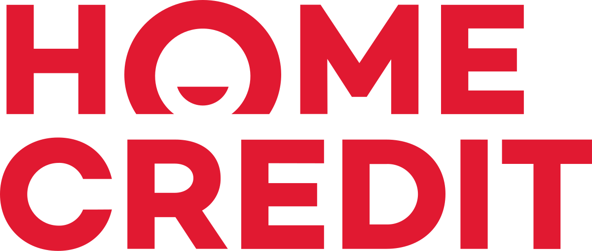
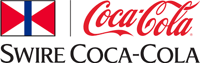

## Portfolio

---

### Capstone Projects

[Home Credit Default Risk](https://github.com/alexiacw11/HomeCreditDefaultRisk)

---
[Swire Coca-Cola Case Competition](sample_page.md)

---

### Kaggle Competitions

- [Restaurant Revenue Prediction](https://github.com/alexiacw11/RestaurantRevenuePrediction)
- [Bike Share](https://github.com/alexiacw11/BikeShare)
- [Amazon Employee Access](https://github.com/alexiacw11/AmazonEmployeeAccess)
- [Ghouls, Ghosts, and Goblins](https://github.com/alexiacw11/Ghouls-Goblins-and-Ghosts)

---

### Statistics Course Coordinator Projects

- [Creamery Rankings](https://github.com/alexiacw11/CreameryRankings)
- [Student Ratings](https://github.com/alexiacw11/StudentRatings)
- [Exam Analyses](https://github.com/alexiacw11/ExamAnalyses)

---

### Hackathons at University of Utah
- [DOMO Hackathon](https://github.com/alexiacw11/DOMOHackathon)

---

