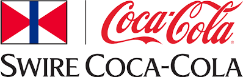
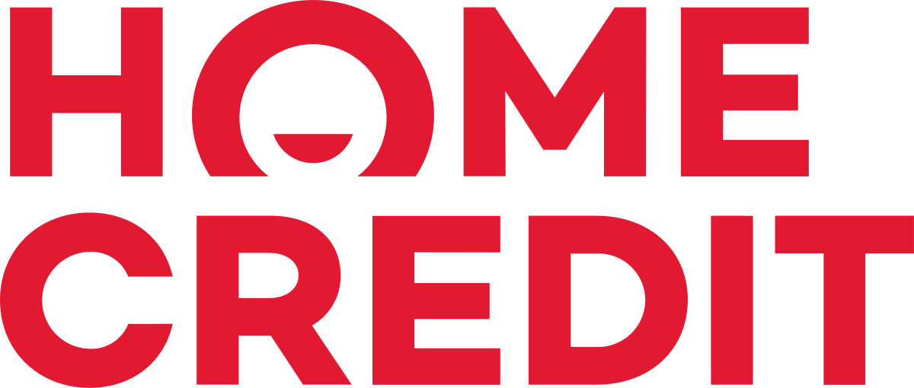

## Portfolio

---
### Operations Specialist Projects
[2025-2026 AAL Annual Report](sample_page2.md)

### Capstone Projects

[Swire Coca-Cola Case Competition (Won First Place!)](sample_page.md)

[Home Credit Default Risk](https://github.com/alexiacw11/HomeCreditDefaultRisk)

---

### Statistics Course Coordinator Projects

- [Creamery Rankings](https://github.com/alexiacw11/CreameryRankings)
- [Student Ratings](https://github.com/alexiacw11/StudentRatings)
- [Exam Analyses](https://github.com/alexiacw11/ExamAnalyses)

---

### Kaggle Competitions

- [Restaurant Revenue Prediction](https://github.com/alexiacw11/RestaurantRevenuePrediction)
- [Bike Share](https://github.com/alexiacw11/BikeShare)
- [Amazon Employee Access](https://github.com/alexiacw11/AmazonEmployeeAccess)

---

### Hackathons at the University of Utah
- [DOMO Hackathon (Won Third Place!)](https://github.com/alexiacw11/DOMOHackathon)

---

### Past Internships
- [Software Engineer at ST Engineering iDirect](https://github.com/alexiacw11/Internships)
- [Business Intelligence at RainFocus](https://github.com/alexiacw11/Internships)

